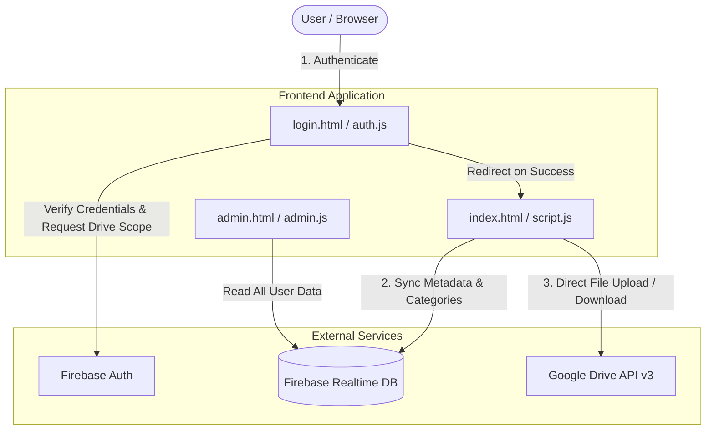

<div align="center">

# 📁 RexDocs

**A modern, cloud-powered document management web application with Glassmorphism UI, Firebase real-time database, and Google Drive integration.**

[](https://github.com/ramunarlapati-13/rexdocs)
[](https://firebase.google.com/)
[](https://developers.google.com/drive)
[](https://developer.mozilla.org/en-US/docs/Web/JavaScript)
[](https://developer.mozilla.org/en-US/docs/Web/CSS)

[Overview](#-overview) • [Features](#-features) • [System Architecture](#-system-architecture) • [Tech Stack](#-tech-stack) • [Project Structure](#-project-structure) • [Data Schema](#-firebase-data-schema) • [Getting Started](#-getting-started) • [Security](#-security--access-control)

</div>

---

## 🚀 Overview

**RexDocs** is a sleek, glassmorphism-styled web application for secure, cloud-backed document organization. It empowers users and administrative teams to upload, organize, search, preview, and download documents seamlessly.

Files are stored directly inside the user's **Google Drive** storage via OAuth 2.0, while metadata (categories, document tags, sizes, and file IDs) is synchronized in real-time using **Firebase Realtime Database**.

### Key Highlights
- 🎨 **Glassmorphism UI**: Built with custom Vanilla CSS featuring blurred glass cards, dynamic color themes, and smooth micro-animations.
- 🔒 **Zero Server Storage Overhead**: Files reside directly in the user's personal or organization Google Drive.
- ⚡ **Real-time Sync**: Firebase Realtime Database instantly updates document lists and categories across sessions.
- 📦 **Bulk Category Export**: Download an entire category of documents as a compressed ZIP file with a single click.

---

## ✨ Features

| Category | Feature | Description |
|---|---|---|
| **Authentication** | 🔐 Dual Sign-In | Firebase Auth supporting Email/Password & Google OAuth 2.0 Sign-In. |
| **Storage & Sync** | ☁️ Google Drive Storage | Direct multipart upload to Google Drive using the user's OAuth access token. |
| | 📊 Live Storage Tracker | Dynamic progress bar tracking total storage used against a 5 GB limit. |
| **Organization** | 📂 Custom Categories | Create, edit, recolor, and delete custom color-coded categories. |
| | 🔍 Real-Time Search | Instant search filtering across document names and category tags. |
| | 🗂️ Grid & List Layouts | Toggle between visual grid cards and detailed list views. |
| **File Operations**| 📤 File & Folder Uploads | Drag-and-drop support for single files or complete folder hierarchies. |
| | 👁️ Document Preview | Inspection modal displaying file metadata (file type, size, thumbnail, modified date). |
| | 📦 ZIP Archiving | Client-side ZIP generation via JSZip to export whole categories at once. |
| **Administration** | 🛡️ Admin Dashboard | Real-time monitoring portal to view multi-user profiles, category stats, and raw JSON data. |
| **Responsive UI** | 📱 Mobile Friendly | Collapsible sidebar drawer and responsive layout tuned for mobile and desktop screens. |

---

## 🏗️ System Architecture



---

## 🛠️ Tech Stack

- **Frontend Core:** HTML5, Vanilla CSS3 (Custom Glassmorphism Design System), JavaScript (ES Modules)
- **Authentication & Database:** [Firebase v11.1.0](https://firebase.google.com/) (Auth + Realtime Database)
- **Cloud File Storage:** [Google Drive API v3](https://developers.google.com/drive/api) (via OAuth 2.0 REST endpoints)
- **Compression Library:** [JSZip v3.10.1](https://stuk.github.io/jszip/)
- **UI Assets & Fonts:** [Font Awesome 6.4.0](https://fontawesome.com/) & [Google Fonts (Outfit)](https://fonts.google.com/specimen/Outfit)

---

## 📂 Project Structure

```
rexdocs/
├── index.html       # Main application dashboard (authenticated workspace)
├── login.html       # Auth portal (Email/Password & Google OAuth tabbed interface)
├── admin.html       # Administrator control panel for database monitoring
├── script.js        # Core client logic (Drive API integration, CRUD, ZIP exports, UI state)
├── auth.js          # Authentication handler & session state guard
├── admin.js         # Admin dashboard real-time data listener & visualizer
├── style.css        # Global glassmorphism design system & responsive layout styles
├── README.md        # Project documentation
└── .gitattributes   # Git configuration
```

---

## 📊 Firebase Data Schema

Data in the Firebase Realtime Database is structured per authenticated user ID (`uid`):

```json
{
  "users": {
    "<USER_UID>": {
      "profile": {
        "email": "user@example.com",
        "displayName": "User Name",
        "lastSeen": "2026-08-12T19:00:00.000Z"
      },
      "categories": {
        "<CAT_ID>": {
          "name": "Work Reports",
          "color": "#6366f1"
        }
      },
      "documents": {
        "<DOC_ID>": {
          "name": "Report_2026.pdf",
          "categoryId": "<CAT_ID>",
          "type": "pdf",
          "size": "2.4 MB",
          "sizeBytes": 2516582,
          "date": "2026-08-12",
          "thumbnail": "data:image/png;base64,...",
          "driveFileId": "1A2b3C4d5E6f7G8h9I0j"
        }
      }
    }
  }
}
```

---

## 🚦 Getting Started

### Prerequisites

1. **Firebase Project**:
   - Enable **Firebase Authentication** (Email/Password and Google Sign-in providers).
   - Enable **Firebase Realtime Database**.
2. **Google Cloud Console**:
   - Enable **Google Drive API**.
   - Configure the OAuth 2.0 Client ID with your app's origin domain (e.g., `http://localhost:3000` or your production domain).

---

### Local Setup & Execution

1. **Clone the Repository**:
   ```bash
   git clone https://github.com/ramunarlapati-13/rexdocs.git
   cd rexdocs
   ```

2. **Configure Firebase & Google API**:
   Update `firebaseConfig` in [`script.js`](file:///c:/website/rexdocs/script.js), [`auth.js`](file:///c:/website/rexdocs/auth.js), and [`admin.js`](file:///c:/website/rexdocs/admin.js) if connecting to your own Firebase project:
   ```javascript
   const firebaseConfig = {
       apiKey: "YOUR_API_KEY",
       authDomain: "YOUR_PROJECT_ID.firebaseapp.com",
       projectId: "YOUR_PROJECT_ID",
       storageBucket: "YOUR_PROJECT_ID.firebasestorage.app",
       messagingSenderId: "YOUR_SENDER_ID",
       appId: "YOUR_APP_ID",
       databaseURL: "https://YOUR_PROJECT_ID-default-rtdb.firebaseio.com/"
   };
   ```

3. **Serve Locally**:
   > ⚠️ **Important**: Because Firebase ES Modules and Google OAuth require HTTP/HTTPS origin security, open the project via a local web server (do not double-click `index.html` via `file://`).

   Using Node.js `serve`:
   ```bash
   npx serve .
   ```
   Or using Python:
   ```bash
   python -m http.server 3000
   ```
   Or use the VS Code **Live Server** extension.

4. **Access the App**:
   Open `http://localhost:3000` (or `http://localhost:8000`) in your web browser.

---

## 🔐 Security & Access Control

- **OAuth 2.0 Granular Scopes**: Google Drive requests only the `https://www.googleapis.com/auth/drive.file` scope — granting access **only** to files created or opened by RexDocs, protecting all other user files in Drive.
- **Client-Side Auth Guarding**: Firebase `onAuthStateChanged` monitors active sessions and automatically redirects unauthenticated requests back to `login.html`.
- **Session Token Security**: Drive access tokens are stored in `sessionStorage` and cleared automatically upon sign-out.

---

## 📜 License

This project is private and intended for administrative use.

---

<div align="center">
  <sub>Built with ❤️ using Firebase & Google Drive API</sub>
</div>
